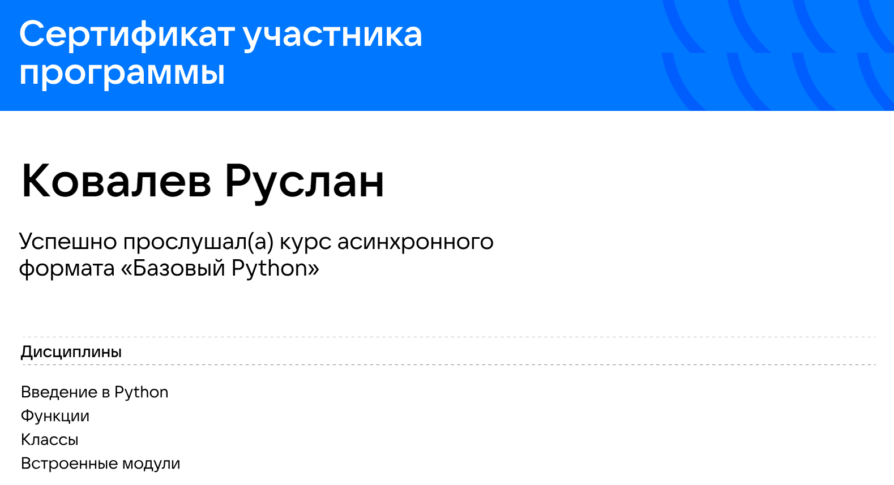
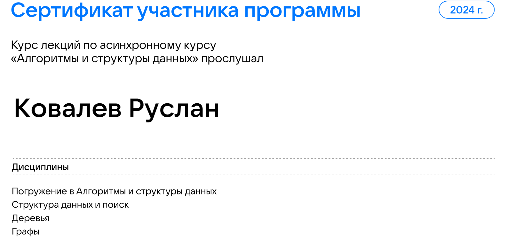

# Certificates
Данный репозиторий содержит следующие сертификаты. В данный момент прохожу курсы по SQL от karpov.courses.

## Зимняя школа от Intel по оптимизации алгоритмов компьютерного зрения. 2022г.
  - Architecture Pipeline
  - Architecture Memory
  - Intro to Optimization
  - Introduction to Parallel Programming
  - Parallel Programming and OpenMP
  - Compiler Overview and Optimization
  - SIMD/autovectorization
  - Vectorization with Intel Advisor
  - Perfomance metrics
  - Profiling and Benchmarking with Intel VTune
  - Introduction to Computer Vision
  - Optimization with OpenCV
  - OpenCV overview
  - OpenVINO overview

## Введение в машинное обучение и нейронные сети. 2022г.
  - Классические методы машинного обучения.
  - Введение в глубокое обучение.

## Базовый Python от VK. 2023г.
  - Введение в Python
  - Функции
  - Классы
  - Встроенные модули

## Алгоритмы и структуры данных от VK. 2023г.

  - Введение в структуры данных
  - Структуры данных и поиск
  - Деревья
  - Графы

